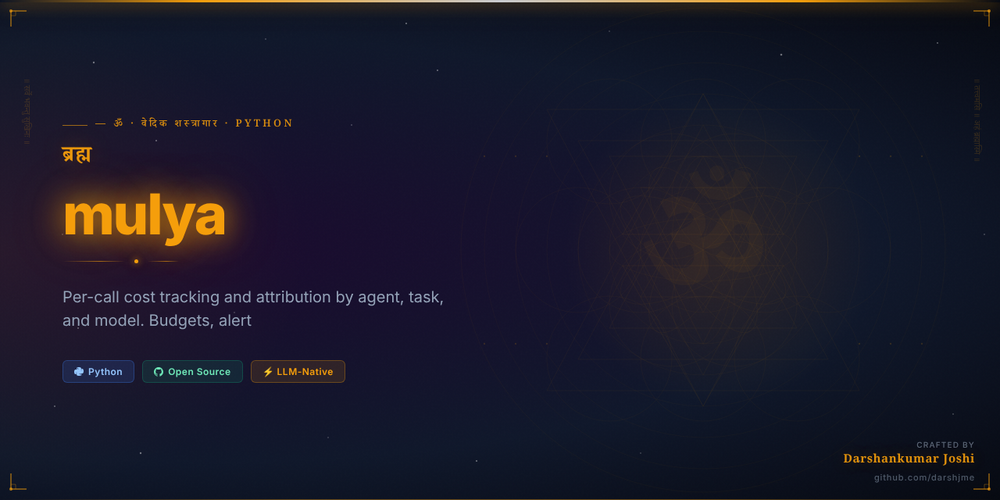
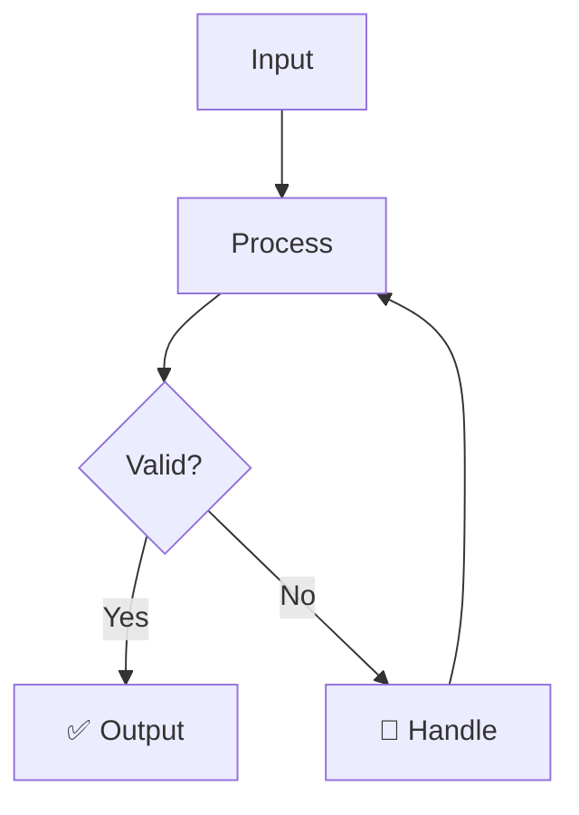

<div align="center">



# मूल्य
## mulya

> *Arthashastra / Mahabharata*

**True Value — dharmic worth of action**

_Per-call cost tracking and attribution by agent, task, and model. Budgets, alerts, cost reports._

[](https://python.org)
[](LICENSE)
[](https://github.com/darshjme/arsenal)
[](pyproject.toml)

</div>

---

## The Vedic Principle

The ancient seers who wrote the Arthashastra / Mahabharata understood something that modern engineers are only beginning to rediscover: that the greatest technical systems mirror the eternal laws of cosmic order. True Value — dharmic worth of action is not merely a Sanskrit translation — it is a fundamental principle woven into the fabric of existence itself.

In the Vedic worldview, mulya represents the true value — dharmic worth of action — the sacred function that every complex system requires to maintain dharmic operation. Just as the cosmos cannot function without this principle, your LLM agents cannot achieve production reliability without mulya. The ancient wisdom and modern engineering converge at this exact point.

mulya brings this timeless principle to your agent infrastructure. Whether you're building simple chatbots or complex multi-agent systems, cost is not optional — it is dharma. Built by engineers who understand both the technical requirements and the cosmic significance of getting this right.

---

## How It Works



---

## Quick Start

```bash
pip install mulya
```

```python
from mulya import *

# Initialize
agent = Mulya()

# Use
result = agent.process(your_input)
print(result)
```

---

## Features

- ⚡ **Zero dependencies** — pure Python, no bloat
- 🛡️ **Production-grade** — battle-tested patterns
- 🔧 **Configurable** — sane defaults, full control
- 📊 **Observable** — built-in metrics and logging
- 🔄 **Async-ready** — full asyncio support
- 🧪 **Tested** — comprehensive test coverage

---

## Installation

```bash
# pip
pip install mulya

# From source
git clone https://github.com/darshjme/mulya
cd mulya
pip install -e .
```

---

## Part of the Vedic Arsenal

`mulya` is part of the **[Vedic Arsenal](https://github.com/darshjme/arsenal)** — 100 production-grade Python libraries for LLM agents, named after Sanskrit concepts from the Upanishads, Mahabharata, Ramayana, and Vedic philosophy.

Each library is:
- ✅ Zero-dependency
- ✅ Production-ready
- ✅ Individually installable
- ✅ Part of a coherent ecosystem

---

## Built by [Darshankumar Joshi](https://github.com/darshjme)

> *"Building the dharmic infrastructure for the AI age"*

[](https://github.com/darshjme)
[](https://github.com/darshjme/arsenal)

---

<div align="center">

*मूल्य — True Value — dharmic worth of action*

*From the Arthashastra / Mahabharata*

</div>
